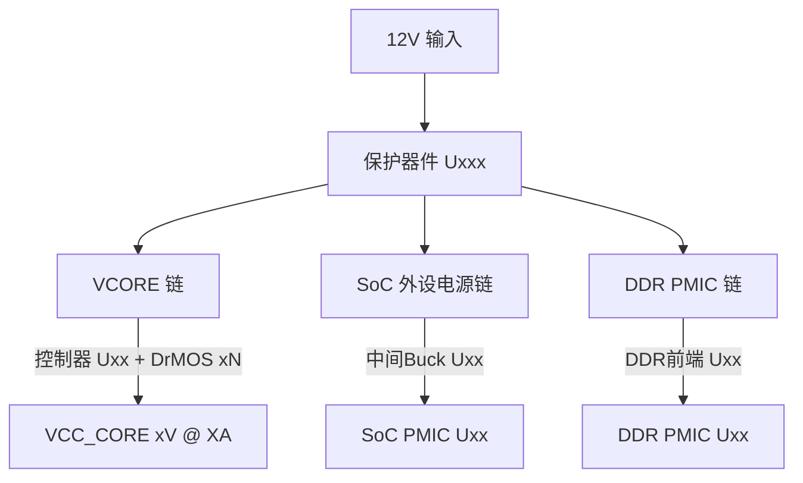

# 报告格式规范

> 最终报告 .md 模板规范。hw_write 生成报告、hw_auditor 审核报告时强制遵循。
> 与 hardware-reviewer.md §6 配合使用。
> 字体/颜色/页边距等样式约束由 .docx 渲染模板处理，不在此文件定义。

---

## 一、报告整体结构

```
封面
 ├─ 报告标题: "[项目名] 硬件原理图检查报告"
 └─ 元信息行 (生成日期 | 版本 | 规则来源 | EDN 文件)

§0 报告概览 (摘要表 + 五级统计)
§1 规则适用度声明
§2~§N  按检查维度动态生成 (引脚核对/电平/复用/供电/接口/连接器/悬空)
附录A 全量结论汇总表
附录B IC 全量清单 + Datasheet 对照表
附录C 参考来源
```

### 章节编号：与 hardware-reviewer.md hw_write 一致，使用 §0-§N 编号。附录使用 附录A/B/C。

---

## 二、每章内部结构

### 2.1 章节开头

每章以概述开头，说明检查范围、规则来源、数据来源、五级统计：

```
本章对 [检查对象] 执行 [检查维度] 检查。
规则来源: hardware-reviewer.md。数据来源: evidence/*.json。
共检查 [N] 项，🔴CRITICAL: [n] | 🟡WARNING: [m] | 🟢OK: [k] | 🔵INFERRED: [p] | ⚫UNVERIFIED: [q]
```

### 2.2 逐项结论格式

每个检查项必须包含：

```
🔴/🟡/🟢/🔵/⚫ [等级]

检查对象: [芯片位号/信号名/接口名]
问题描述: [一句话]
实际值: [从 EDN 追踪到的物理事实]
期望值: [从手册/规范得出的正确值]
EDN 证据: [行号 或 net body 原文]
手册引用: [手册名, 页码, 表格号, 原文]
JSON 证据: evidence/{name}.json → $.path
建议: [CRITICAL/WARNING 时给出修正建议]
```

**同组 OK 项的批量格式**（全部 OK 且结构相同时可用）：
```
🟢 OK  检查对象: [同组信号名列表]
DDR DQ[0:7] 全部 Byte Lane 内编号对应正确。详情见 evidence/{name}.json。
```
禁止在无证据支撑的情况下仅写"全部OK"概括。

---

## 三、封面与元信息

```
# [项目名] 硬件原理图检查报告

生成日期: YYYY-MM-DD  |  版本 V1.0  |  规则来源: hardware-reviewer  |  EDN 文件: [filename.EDN]
```

### §0 报告概览

| 项目 | 数值 |
|---|---|
| EDN 文件名 | xxx.EDN |
| 网络总数 | N nets |
| 实例总数 | M instances |
| 功能 IC 数量 | K 颗 |
| 手册 FOUND / MISSING | K1 / K2 |

| 等级 | 数量 | 占比 |
|---|---|---|
| 🔴 CRITICAL | N | % |
| 🟡 WARNING | N | % |
| 🟢 OK | N | % |
| 🔵 INFERRED | N | % |
| ⚫ UNVERIFIED | N | % |

---

## 四、附录

### 附录A：全量结论汇总表

| 编号 | 等级 | 章节 | 检查对象 | 问题摘要 | EDN 行号 | JSON 证据 |
|---|---|---|---|---|---|---|

### 附录B：IC 全量清单 + Datasheet 对照表

| 位号 | 型号 | 类型 | 封装 | Datasheet 状态 | 手册路径/URL |
|---|---|---|---|---|---|

### 附录C：参考来源

| 来源 | 文件/版本 | 用途 |
|---|---|---|
| EDN 网表 | xxx.EDN | 所有物理连接验证的数据来源 |
| 手册 | {manual_dir}/... | ... |

---

## 五、与 JSON 证据的关联规则

- 报告中每个 🔴CRITICAL 或 🟡WARNING 结论，必须在附录A中标注对应的 JSON 证据文件
- 证据文件放在 `evidence/` 目录下
- 证据文件命名遵循 hardware-reviewer.md §4.0a 统一命名规范
- 报告中引用证据时，必须具体到 JSON 路径 (如 `$.pmic.U118.vout`)，不可只写文件名

---

## 六、供电架构分析章节模板

### 6.1 供电架构总览

使用 mermaid 绘制系统供电框图：



要求：标注每节点的器件型号、控制方式 (独立控制用虚线)、关键参数 (tSS/VTH 等)。

### 6.2 每颗 PMIC 功能表

| 芯片型号 | 位号 | 数量 | 输入电压 | 输出电压 | 功能描述 | 关键参数 |
|---|---|---|---|---|---|---|

要求：按供电链路分组、关键参数从 G0 手册检索提取。

### 6.3 每路电源电压功能表

| 电源轨 | 来源 PMIC | 电压 | 主要消费者 | 功能说明 |
|---|---|---|---|---|

要求：标注每节点独立轨 (★) 和公共轨，消费者列含所有功能 IC 电源引脚。

### 6.4 上电时序

**时间参数汇总表**：

| 阶段 | 时间参数 | 计算值 | 来源 (手册 页码 原文) | 备注 |
|---|---|---|---|---|

要求：按上电顺序排列，来源必须手册原文引用。

**时序波形图** (mermaid)：

```mermaid
gantt
    title 上电时序
    dateFormat X
    axisFormat %s ms
    section 输入端
    12V稳定 :done, 0, 5
    section PMIC1
    软启动SS : 5, 10
    Vout稳定 : 10, 20
    section PMIC2
    EN使能 : 20, 22
    输出建立 : 22, 35
```



关键时间点标注 t₀, t₁, t₂...，标注所有 SS/PG/RSTODELAY 参数。

### 6.5 控制逻辑

**使能链 (EN Chain)**、**电源就绪链 (PG Chain)**、**复位链 (Reset Chain)** 均用 mermaid 流程图：


### 6.6 待确认参数

| 参数 | 所属 PMIC | 无法确定原因 | 建议确认方式 |
|---|---|---|---|

要求：建议确认方式必须可操作 (寄存器地址/测量点/FAE 联系)，不可写"人工确认"。

---

## 七、其他章节的简化模板

### 7.1 引脚核对 / 电平检查

结构: 概述 → 逐项结论 → 汇总表。OK 项可批量，必须引用 JSON 证据。

### 7.2 接口电路检查

按接口类型分小节 (I2C/UART/SPI/DDR/PCIe...)。每个小节: 概述 + 逐项结论。DDR 需含 ZQ/差分极性/Byte Lane 子节。

### 7.3 连接器接口

按连接器分小节 (J1/J2/...)。每个连接器: 8 列逐引脚表 + 差异/异常逐项结论。

### 7.4 悬空引脚

全量 portInstance-vs-portRef 差集 → 按芯片排列 → FLOATING 表 (引脚名/类型/等级/说明)。

---

## 八、生成技术要求

- 所有节以 `## §N 标题` 开头
- 表格用标准管道语法 `| col | col |`
- 结论标签用 `**CRITICAL**` / `**WARNING**` / `OK`
- 代码引用用反引号

**生成输入** (hw_write 读取):
- `evidence/*_summary.json` — 各维度检查摘要 (≤5KB)
- `evidence/*_evidence.json` — 原始证据 (仅需详细回溯时)
- `prep/*.json` — 元数据 (IC 清单/网表)

**输出**: `{项目名}_审查报告.md` → 项目根目录
